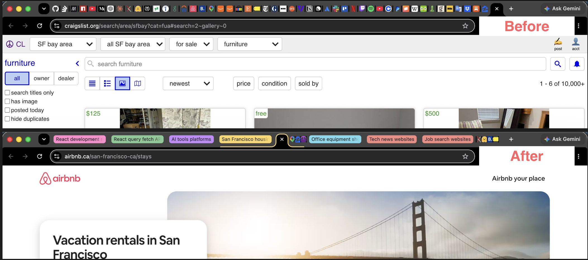
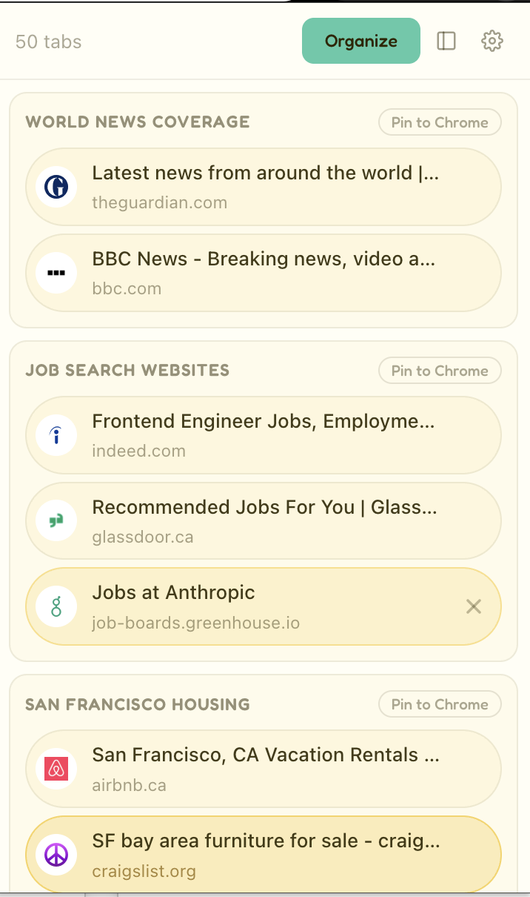
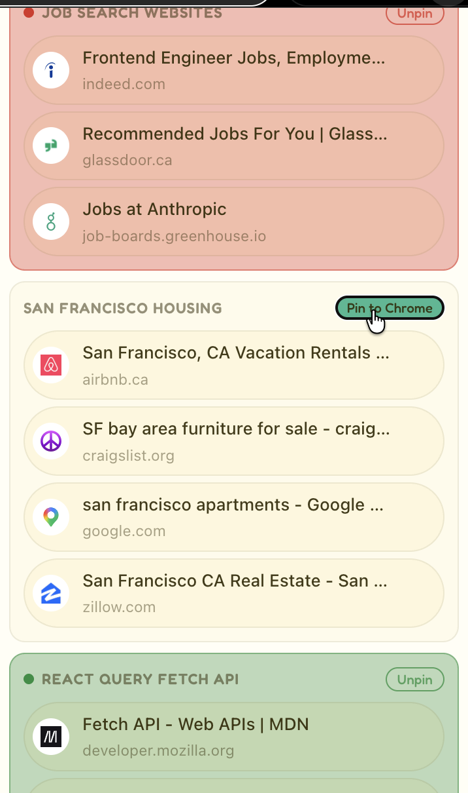
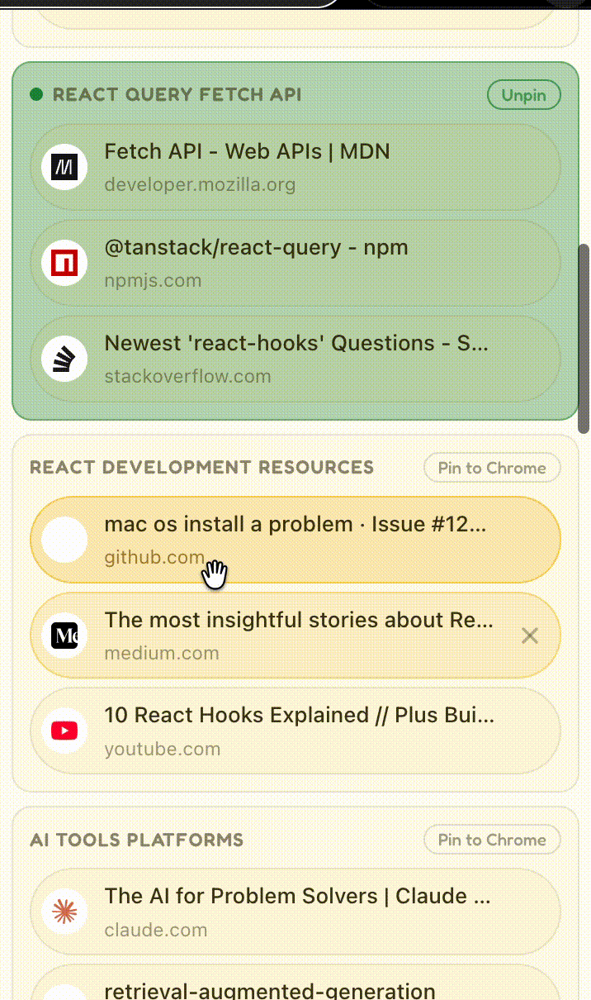
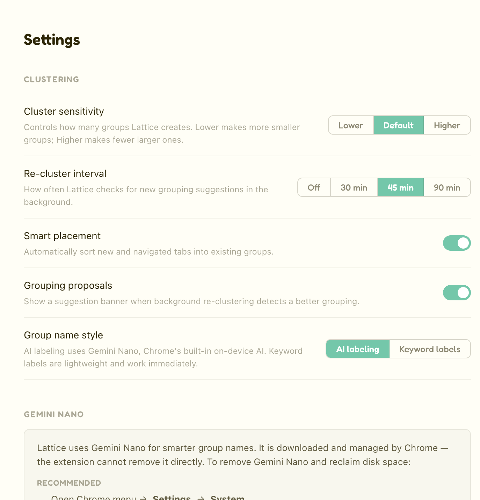

# Lattice


**Lattice organizes your Chrome tabs into meaningful groups, automatically.**



If you keep Chrome open for days at a time and regularly have 50, 80, or 150+ tabs, Lattice watches them in the background, works out which ones are related, and groups them under a short descriptive name — no folders to maintain, no workspaces to build, no manual sorting.

Everything runs on your device. Your tabs, titles, and URLs never leave your computer — there's no server, no account, and no telemetry.

## Why Lattice

Somewhere around 30–40 tabs, favicons blur together and you can't tell which is which. Beyond 80, you're guessing. You know the tab you want is open somewhere — you just can't find it. Every existing "solution" makes you do more work: bookmarks require organizing, tab groups require naming, session managers require saving.

Lattice's promise is different: the tabs organize themselves, based on what they actually are.

## How it works

1. Click **Organize**. Lattice reads the titles and URLs of your open tabs and clusters the related ones together using a small local embedding model.
2. Each group gets a short name, generated on-device via Chrome's built-in AI (Gemini Nano) when available, falling back to local keyword extraction otherwise.
3. New tabs get placed into the right group automatically as you open them. If a group starts to drift, Lattice proposes a better organization — you decide whether to apply it.

You can optionally pin any group to Chrome's native tab bar, drag tabs between groups, rename groups inline, and close tabs — all from the popup or side panel.

## Screenshots

**Organized clusters in the popup**


**Pin to Chrome — publish a cluster as a native tab group**


**Drag-and-drop and inline rename**


**Settings — sensitivity, AI labeling, and background behavior**


## Features

- Automatic clustering of open tabs by topic (agglomerative clustering over local ML embeddings)
- On-device AI cluster naming (Gemini Nano) with a silent keyword-based fallback
- Smart placement of new/navigated tabs into existing groups
- Background re-clustering with opt-in proposals — never auto-applied
- Optional "Pin to Chrome" integration with Chrome's native tab groups
- Drag-and-drop tab movement between groups, with inline rename
- Adjustable clustering sensitivity and re-cluster interval
- Full side panel view for large tab sets, plus a diagnostics panel for power users

## How Lattice differs

- **OneTab** is about closing tabs to save memory; Lattice is about organizing them while they're open.
- **Toby / Workona** require you to build and maintain a workspace structure. Lattice figures out the structure automatically.
- **Session managers** save snapshots. Lattice maintains a live organization.
- **Arc's spaces** require switching browsers. Lattice works in the Chrome you already use.

## Privacy

Lattice runs entirely on your device. The ML model that clusters your tabs ([Xenova/all-MiniLM-L12-v2](https://huggingface.co/Xenova/all-MiniLM-L12-v2)) and the keyword-based label fallback both run locally in the browser via Transformers.js. Cluster state is stored only in `chrome.storage.local`. There are no accounts, no servers, no analytics, and no tracking. Lattice does not request the `<all_urls>` permission and never reads page contents — only tab titles and URLs.

## Installation

Lattice isn't yet published to the Chrome Web Store — install it from source:

**Requirements:** Node.js `20.19+` or `22.12+`, and Google Chrome.

```bash
git clone https://github.com/project-assistance/TidyTabs.git
cd TidyTabs
npm install
npm run build
```

Then load the built extension into Chrome:

1. Open `chrome://extensions/`
2. Enable **Developer mode** (top right)
3. Click **Load unpacked** and select the `dist/` folder produced by `npm run build`

Lattice's icon will appear in the toolbar. Click it to open the popup, or use the "Open in side panel" button for a larger view.

## Using Lattice

1. **Open Lattice.** Click its toolbar icon for the popup, or use the "Open in side panel" button inside the popup for a larger view alongside your tabs.
2. **Click Organize.** Lattice clusters your currently open tabs into named groups. This takes a few seconds the first time (the local model has to load).
3. **Review the groups.** Each cluster shows its tabs under a short auto-generated label. Anything that doesn't fit a clear group lands in **Ungrouped**.
4. **Pin a group to Chrome (optional).** Click **Pin to Chrome** on any named group to publish it as a native Chrome tab group with a colored header in your tab bar. **Unpin** removes it from the tab bar without closing the tabs.
5. **Rename a group.** Click its label, type a new name, press Enter. If the group is pinned, Chrome's tab group title updates too.
6. **Move a tab between groups.** Drag any tab card onto another group to move it there.
7. **Let it maintain itself.** New tabs you open are automatically placed into the right existing group. Every so often, Lattice quietly re-checks your tabs in the background and — only if it finds a meaningfully better organization — shows a banner proposing the change. Nothing is rearranged without your approval.
8. **Tune it in Settings** (gear icon in the popup): clustering sensitivity (looser vs. tighter groups), how often background re-clustering runs, whether new tabs get smart-placed automatically, whether background proposals are shown, and whether group names use on-device AI or plain keyword extraction.

## FAQ

**Does Lattice send my browsing data anywhere?**
No. Everything runs on your device. Lattice doesn't have a server, doesn't have an account system, and doesn't include any tracking.

**Why does Lattice need the Gemini Nano AI model? Do I have to download it?**
The optional AI feature that names your clusters uses Chrome's built-in Gemini Nano, which Chrome downloads itself on qualifying hardware. Lattice doesn't require it — if Nano isn't available, Lattice uses a small keyword extractor to name groups instead. You can also turn AI naming off entirely in Settings.

**What permissions does Lattice request, and why?**
See the [Permissions](#permissions) table below. Lattice does not request `<all_urls>` and does not read the contents of pages you visit.

**Will this work with Firefox / Safari / Edge?**
Not yet. Lattice is Chrome-first because it relies on Chrome's tab group and built-in AI APIs.

**Is this free?**
Yes. No account, no signup, no catch.

## Development

```bash
npm run dev         # Vite dev server with hot reload for popup/sidepanel
npm run build        # Type-check and produce a production build in dist/
npm run preview      # Preview the production build
npm test             # Run the test suite once
npm run test:watch   # Re-run tests on file change
```

After `npm run dev`, load `dist/` as an unpacked extension as described above. Popup and side panel changes hot-reload automatically; `background.ts` changes require clicking refresh on `chrome://extensions/`.

## Contributing

Issues and pull requests are welcome. If you're planning a larger change, open an issue first to discuss the approach.

## Permissions

| Permission | Why |
|---|---|
| `tabs`, `tabGroups` | Read open tabs and manage Chrome's native tab groups |
| `storage` | Save cluster state locally on your device |
| `offscreen`, `alarms` | Run the ML pipeline off the main thread and schedule background re-clustering |
| `sidePanel` | Power the side panel view |
| `aiAssistant` | Optional on-device cluster naming via Chrome's built-in AI (Gemini Nano) |

## License

MIT — see [LICENSE](LICENSE).
